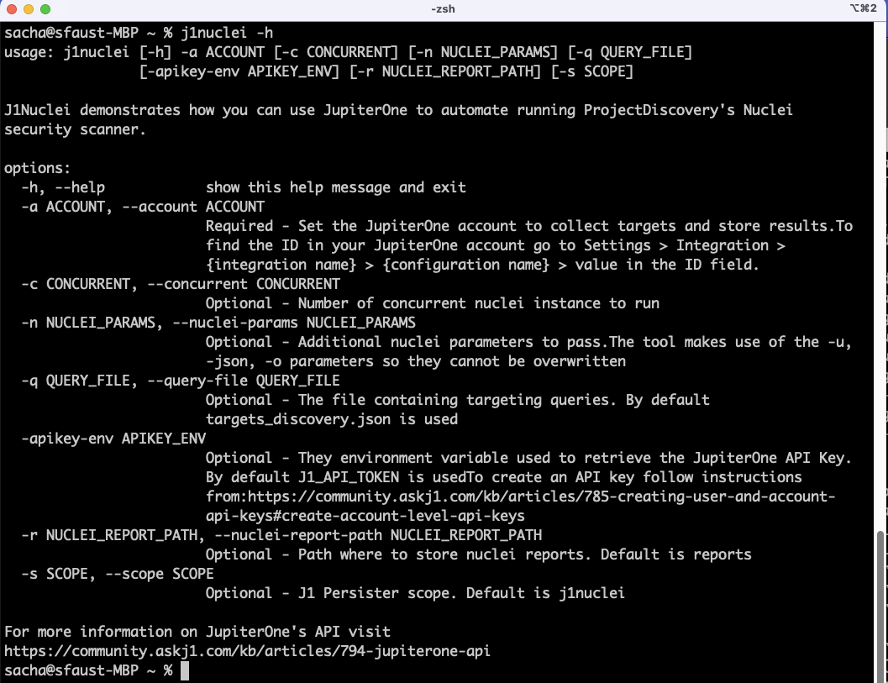
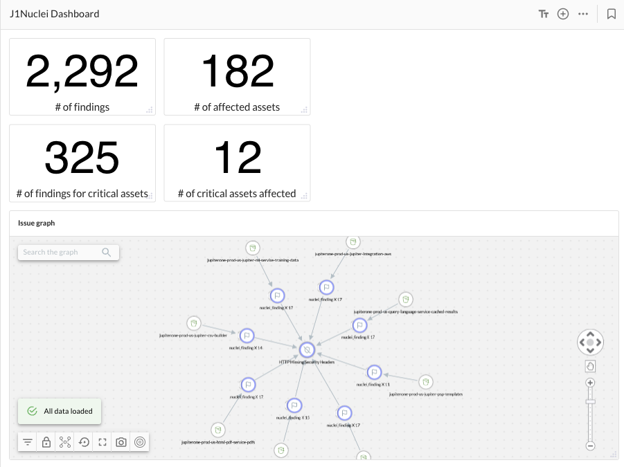

<br>

## About
J1Nuclei is a CLI tool demonstrating how JupiterOne platform can automate and learn from other tools. 
It automates everyday security tasks of scanning endpoints for vulnerabilities. Once scans are complete, the tool returns findings to our JupiterOne knowledge graph. Results can be reviewed, prioritized, and measured using Jupiterone console and insight dashboards.

### Quickstart

The tool can be installed by simply cloning the repository and starting the module.

1. [Get Started](https://info.jupiterone.com/start-account) - If you're not already using JupiterOne, it's free (no credit card).
2. Clone repository <br>
``git clone git@github.com:JupiterOne/j1nuclei.git``
3. Get JupiterOne API token<br>
Follow instructions from [Create User and Account API](https://community.askj1.com/kb/articles/785-creating-user-and-account-api-keys) Keys kb article.
<br>
4. Export your api key to the environment variable ``J1_API_TOKEN``<br>
``export J1_API_TOKEN="<your key>"``
5. Launch j1nuclei<br>


## Exploring Findings
Findings are mapped back into our graph using the following schema<br>

### 1. JupiterOne Query Language (J1QL)
More information about J1QL is available from [Introduction to JupiterOne Query Language](https://community.askj1.com/kb/articles/980-introduction-to-jupiterone-query-language-j1ql)
The J1QL and knowledge graph can answer many questions, here's a few from the data set produced by J1Nuclei

#### How many nuclei issues do I have?
```
FIND nuclei_finding as f
RETURN count(f) as value
```

#### How many my critical assets in production are affected?
```
FIND *
WITH tag.Production = true AND classification = 'critical' AS asset
THAT HAS >> nuclei_finding
RETURN COUNT(asset)
```
#### How many endpoints are affected?
```
FIND UNIQUE * as asset
THAT HAS >> nuclei_finding
RETURN count(asset) as value
```

#### Criticality of the issues?
```
FIND nuclei_finding as f
WHERE f._type = "nuclei_finding"
RETURN f.severity as x, count(f) as y
```

#### What are my issues (graph view)?
```
FIND *
THAT HAS >> nuclei_finding
THAT IS >> nuclei_vulnerability
RETURN TREE
```

### 2. Insight Dashboard
You can also create dashboards using our console Insights. For starters, you can use the one we provided as part
of this tool [nuclei_portal_schema.json](dashboard_nuclei_portal.json). Steps to create, edit, and upload your own
dashboard are available from [Getting started with insights-dashboards](https://community.askj1.com/kb/articles/812-getting-started-with-insights-dashboards).
We also shared many dashboards in our open-source repository from [https://github.com/JupiterOne/insights-dashboards](https://github.com/JupiterOne/insights-dashboards).



## Customizing target discovery
Because getting a comprehensive view may require several queries, j1nuclei use a JSON file [target_query.json](targets_discovery.json)
to define all queries to run. The file is populated with common queries by default and is extensible with any J1QL queries.
For more information on our J1QL language is available from our [support site]("https://community.askj1.com/kb/articles/980-introduction-to-jupiterone-query-language-j1ql") 
and other questions implementation is available from [JupiterOne Questions library]("https://ask.us.jupiterone.io/filter?tagFilter=all").